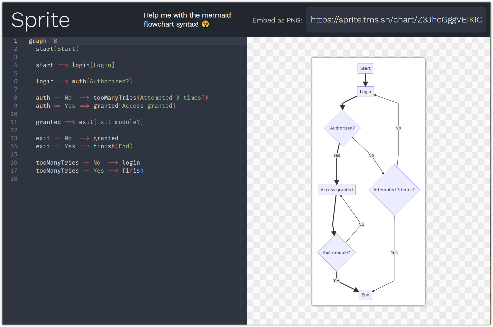

  
  
    
    
  

  

  Draw charts with code. Render in real-time. Embed anywhere as .png. <strong><a href="https://sprite.link">Open Sprite.</a></strong>

---

  <!-- Stability -->
  
  
  

  Built with ❤ by <a href="https://twitter.com/TimoStaudinger">Timo M. Staudinger</a> and <a href="https://github.com/TimoSta/sprite/graphs/contributors">contributors</a>.

 

  

